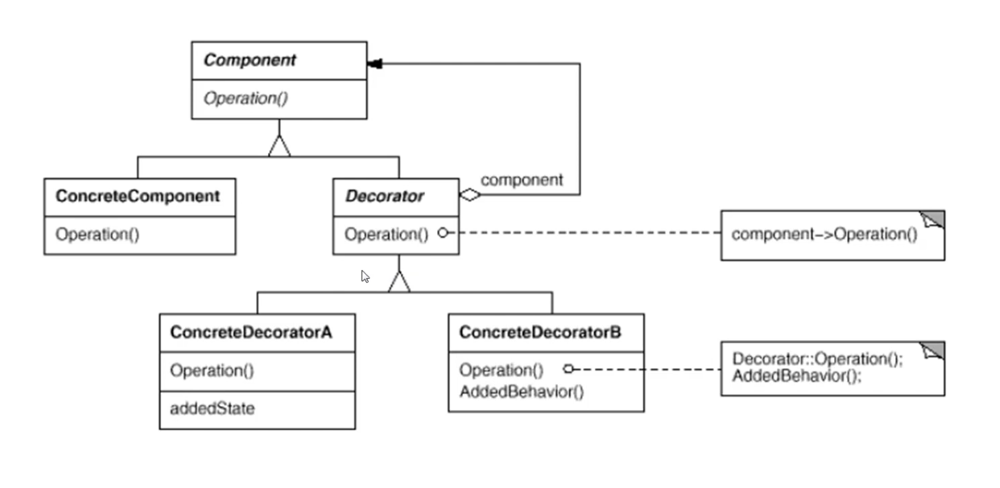

# 입출력 스트림

## 입출력 스트림이란?

네트웍에서 자료의 흐름이 물과 같다는 의미에서 유래

다양한 입출력 장치에 독립적으로 일관성 있는 입출력 방식 제공

입출력이 구현되는 곳에서는 모두 I/O 스트림을 사용

: 키보드, 파일 디스크, 메모리 등


### 입출력 스트림 구분?

I/O 대상 기준  입출 스트림, 출력 스트림

자료의 종류 : 바이트 스트림, 문자 스트림

스트림의 기능 : 기반 스트림, 보조 스트림

- byte스트림은 뒤에 Stream이 붙는다.


### 입출력 스트림과 출력 스트림

입력 스트림 : 대상으로부터 자료를 읽어 들이는 스트림

출력 스트림 : 대상으로 자료를 출력하는 스트림


스트림의 예

| 종류        | 예시                                                         |
| ----------- | ------------------------------------------------------------ |
| 입력 스트림 | FileInputStream, FileReader, BufferedInputStream, BufferedReader 등 |
| 출력 스트림 | FileOutputStream, FileWriter, BufferedOutputStream, BufferedWriter 등 |


#### 바이트 단위 스트림과 문자 단위 스트림

바위트 단위 스트림 : 바이트 단위로 자료를 읽고 씀(동영상, 음악 파일 등)

문자 단위 스트림 : 문자는 2byte씩 처리 해야한다


스트림의 예

| 종류          | 예시                                                         |
| ------------- | ------------------------------------------------------------ |
| 바이트 스트림 | FileInputStream, FileOutputStream, BufferedInputStream, BufferedOutputStream 등 |
| 문자 스트림   | FileReader, FileWriter, BuffredReader, BufferedWriter 등     |


#### 기반 스트림과 보조 스트림

기반 스트림 : 대상에 직접 자료를 읽고 쓰는 기능의 스트림

보조 스트림 : 직접 읽고 쓰는 기능은 없고 추가적인 기능을 제공해주는 스트림

​	기반 스트림이나 또 다른 보조 스트림을 생성자의 매개변수로 포함한다


스트림의 예

| 종류        | 예시                                                         |
| ----------- | ------------------------------------------------------------ |
| 기반 스트림 | FileInputStream, FileOutputStream, FileReader, FileWriter 등 |
| 보조 스트림 | InputStreamReader, OutputStreamWriter, BufferedInputStream, BufferedOutputStream 등 |


## 표준 입출력

### System 클래스의 표준 입출력 멤버

```java
public class System {
    public static PrintStream out; //표준 출력 스트림
    public static InputStream in; //표준 입력 스트림
    public static PrintStream error; //표준 에러 스트림
}
```


#### System.in 사용하여 입력 받기

한 바이트씩 읽어 들임

한글과 같은 여러 바이트로 된 문자를 읽기 위해서는 InputStreamReader와 같은 보조 스트림을 사용해야함


#### Scanner 클래스

java.util 패키지에 있는 입력 클래스

문자뿐 아니라 정수, 실수 등 다양한 자료형을 읽을 수 있다

생성자가 다양하여 여러 소스로부터 자료를 읽을 수 있다.

| 생성자                      | 설명                                                  |
| --------------------------- | ----------------------------------------------------- |
| Scanner(File source)        | 파일을 매개변수로 받아 Scanner를 생성합니다.          |
| Scanner(InputStream source) | 바이트 스트림을 매개변수로 받아 Scanner를 생성합니다. |
| Scanner(String source)      | String을 매개변수로 받아 Scanner를 생성합니다.        |


#### Console 클래스

System.in을 사용하지 않고 콘솔에서 표준 입출력이 가능

이클립스와는 연동되지 않는다. (CMD로 실행해서 해야함)


Console클래스의 메서드

| 메서드                | 설명                                         |
| --------------------- | -------------------------------------------- |
| String readLine()     | 문자열을 읽습니다.                           |
| char[] readPassword() | 사용자에게 문자열을 보여 주지 않고 읽습니다. |
| Reader reader()       | Reader 클래스를 반환합니다.                  |
| PrintWriter writer()  | PrintWriter 클래스를 반환합니다.             |


## 바이트 단위 스트림

InputStream : 바이트 단위 입력 스트림 최상위 클래스

OutputStream : 바이트 단위 출력 스트림 최상위 클래스

추상 메서드를 포함한 추상 클래스로 하위 클래스가 구현하여 사용


주요 하위 클래스

| 스트림 클래스        | 설명                                                         |
| -------------------- | ------------------------------------------------------------ |
| FileInputStream      | 파일에서 바이트 단위로 자료를 읽습니다.                      |
| ByteArrayInputStream | Byte배열 메모리에서 바이트 단위로 자료를 읽습니다.           |
| FilterInputStream    | 기반 스트림에서 자료를 읽을 때 추가 기능을 제공하는 보조 스트림의 상위 클래스 |


| 스트림 클래스         | 설명                                                         |
| --------------------- | ------------------------------------------------------------ |
| FileOutputStream      | 바이트 단위로 파일에 자료를 씁니다.                          |
| ByteArrayOutputStream | Byte배열에 바이트 단위로 자료를 씁니다.                      |
| FilterOutputStream    | 기반 스트림에서 자료를 쓸 때 추가 기능을 제공하는 보조 스트림의 상위 클래스 |


### FileInputStream과 FileOutputStream 사용하기

파일에 한 바이트씩 자료를 읽고 쓰는데 사용

입력 스트림은 파일이 없는 경우 예외 발생

출력 스트림은 파일이 없는 경우 파일 생성하여 출력


## 문자 단위 스트림

Reader : 문자 단위로 읽는 최상위 스트림

Writer : 문자 단위로 쓰는 최상위 스트림

추상 메서드를 포함한 추상 클래스로 하위 클래스가 상속받아 구현


하위 클래스

| 스트림 클래스     | 설명                                                         |
| ----------------- | ------------------------------------------------------------ |
| FileReader        | 파일에서 문자 단위로 읽는 스트림 클래스입니다.               |
| InputStreamReader | 바이트 단위로 읽은 자료를 문자로 변환해 주는 보조 스트림 클래스입니다. |
| BufferedReader    | 문자로 읽을 때 배열을 제공하여 한꺼번에 읽을 수 있는 기능을 제공해 주는 보조 스트림입니다. |


| 스트림 클래스      | 설명                                                         |
| ------------------ | ------------------------------------------------------------ |
| FileWriter         | 파일에 문자 단위로 출력하는 스트림 클래스입니다.             |
| OutputStreamWriter | 파일에 바이트 단위로 출력한 자료를 문자로 변환해 주는 보조 스트림입니다. |
| BufferedWriter     | 문자로 쓸 때 배열을 제공하여 한꺼번에 쓸 수 있는 기능을 제공해 주는 보조 스트림입니다. |


### FileReader와 FileWriter

파일에 문자를 읽고 쓸 때 가장 많이 사용되는 클래스

문자의 인코딩 방식을 지정할 수 있다


## 보조 스트림

실제 읽고 쓰는 스트림이 아닌 보조적인 기능을 추가하는 스트림

FilterInputStream과 FilterOutputStream이 보조스트림의 상위 클래스


생성자의 매개 변수로 또 다른 스트림을 가짐

| 생성자                                      | 설명                                         |
| ------------------------------------------- | -------------------------------------------- |
| protected FilterInputStream(InputStream in) | 생성자의 매개변수로 InputStream을 받습니다.  |
| public FilterOutputStream(OutputStream out) | 생성자의 매개변수로 OutputStream을 받습니다. |

데코레이션 패턴


### 여러가지 보조 스트림 사용하기

Buffered 스트림 : 내부에 8192byte 배열을 가지고 있음. 읽거나 쓸 때 속도가 빠름

DataInputStream / DataOutputStream : 자료가 저장된 상태 그대로 자료형을 유지하며 읽거나 쓰는 기능을 제공하는 스트림


## 직렬화(Serialization)

인스턴스의 상태를 그대로 저장하거나 네트웍으로 전송하고 이를 다시 복원(Deserialization)하는 방식

ObjectInputStream과 ObjectOutputStream사용

보조 스트림


### Serializable 인터페이스

직렬화는 인스턴스의 내용이 외부(파일, 네트웍)로 유출되는 것이므로 프로그래머가 객체의 직렬화 가능 여부를 명시함

구현 코드가 없는 mark interface

```java
class Person implements Serializable { //직렬화하겠다는 의도를 표시
    String name;
    String job;
    transient String test; //transient -> 이 변수는 직렬화하지 말라는 뜻
    //...
}
```


```java
import java.io.*;

class Person implements Serializable {
    String name;
    transient String job; //transient -> 이 값은 직렬화하지 말라는 뜻

    public Person(String name, String job) {
        this.name = name;
        this.job = job;
    }

    @Override
    public String toString() {
        return name + ", " + job;
    }
}

public class SerializationTest {
    public static void main(String[] args) {
        Person lee = new Person("이순신", "엔지니어");
        Person kim = new Person("김유신", "선생님");

        try(FileOutputStream fos = new FileOutputStream("./src/Chapter10/serial.dat");
            ObjectOutputStream oos = new ObjectOutputStream(fos)) {
            oos.writeObject(lee);
            oos.writeObject(kim);
            //java.io.NotSerializableException: Chapter10.steam.serialization.Person
            // -> implements serailizable을 받아줘야 한다.
        } catch(IOException e) {
            System.out.println(e);
        }

        try(FileInputStream fis = new FileInputStream("./src/Chapter10/serial.dat");
            ObjectInputStream ois = new ObjectInputStream(fis)) {
            Person p1 = (Person)ois.readObject();
            Person p2 = (Person)ois.readObject();

            System.out.println(p1);
            System.out.println(p2);
        } catch(IOException e) {
            System.out.println(e);
        } catch(ClassNotFoundException e) {
            System.out.println(e);
        }
    }
}
```


```java
package Chapter10.steam.serialization;

import java.io.*;

class Person implements Externalizable {
    String name;
    transient String job; //transient -> 이 값은 직렬화하지 말라는 뜻

    public Person(String name, String job) {
        this.name = name;
        this.job = job;
    }

    @Override
    public String toString() {
        return name + ", " + job;
    }

    @Override
    public void writeExternal(ObjectOutput objectOutput) throws IOException {
        
    }

    @Override
    public void readExternal(ObjectInput objectInput) throws IOException, ClassNotFoundException {

    }
}

public class SerializationTest {
    public static void main(String[] args) {
        Person lee = new Person("이순신", "엔지니어");
        Person kim = new Person("김유신", "선생님");

        try(FileOutputStream fos = new FileOutputStream("./src/Chapter10/serial.dat");
            ObjectOutputStream oos = new ObjectOutputStream(fos)) {
            oos.writeObject(lee);
            oos.writeObject(kim);
            //java.io.NotSerializableException: Chapter10.steam.serialization.Person
            // -> implements serailizable을 받아줘야 한다.
        } catch(IOException e) {
            System.out.println(e);
        }

        try(FileInputStream fis = new FileInputStream("./src/Chapter10/serial.dat");
            ObjectInputStream ois = new ObjectInputStream(fis)) {
            Person p1 = (Person)ois.readObject();
            Person p2 = (Person)ois.readObject();

            System.out.println(p1);
            System.out.println(p2);
        } catch(IOException e) {
            System.out.println(e);
        } catch(ClassNotFoundException e) {
            System.out.println(e);
        }
    }
}
```


### Serializable와 Externalizable

Serializable은 구현해야하는 요소가 없지만,

Externalizable는 `writeExternal` `readExternal` 메서드를 재정의 해줘야 한다. 해당 메서드들은 읽고 쓰는 기능이다.


## 그 외 입출력 클래스

File 클래스

파일 개념을 추상화한 클래스

입출력 기능은 없고 파일의 속성, 경로, 이름 등을 알 수 있다


RandomAccessFile 클래스

입출력 클래스 중 유일하게 파일 입출력을 동시에 할 수 있는 클래스

파일 포인터가 있어서 읽고 쓰는 위치의 이동이 가능함

다양한 자료형에 대한 메서드가 제공됨


### 데코레이터 패턴(Decorator Pattern)

자바의 입출력 스트림은 데코레이터 패턴을 사용

실제 입출력 기능을 가진 객체(컴포넌트)와 그 외 다양한 기능을 제공하는 데코레이터(보조 스트림)을 사용하여 다양한 입출력 기능을 구현

상속보다 유연한 확장성을 가짐

지속적인 서비스의 증가와 제거가 용이함





Workshop을 통해 이해하면 쉬움